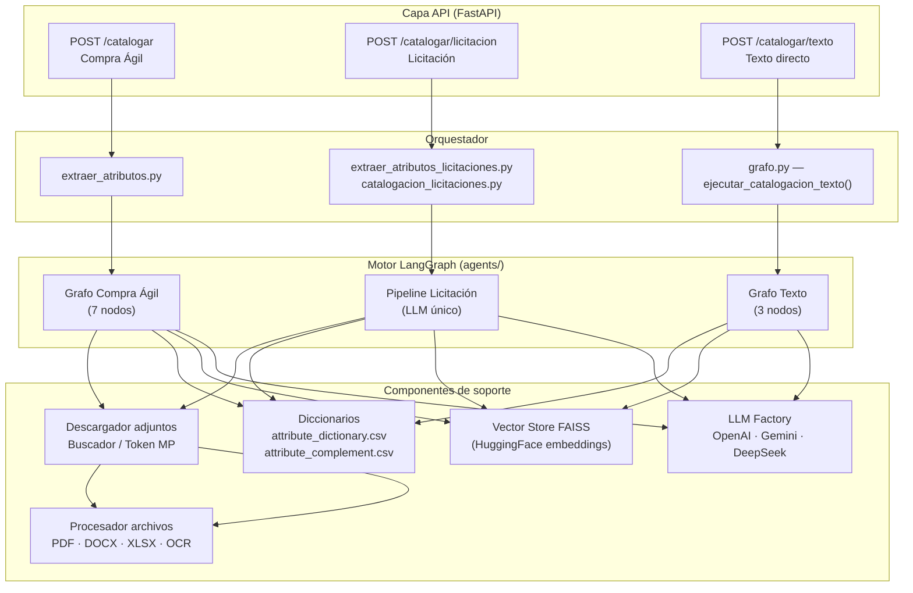
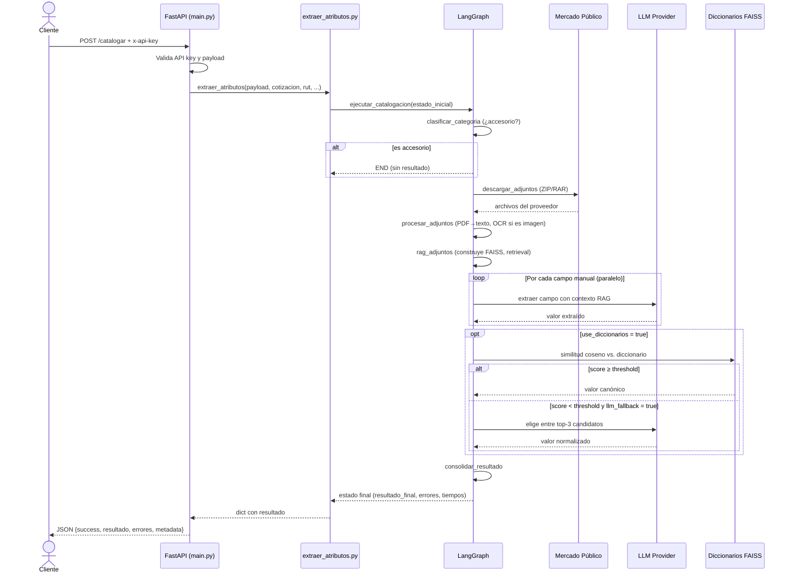
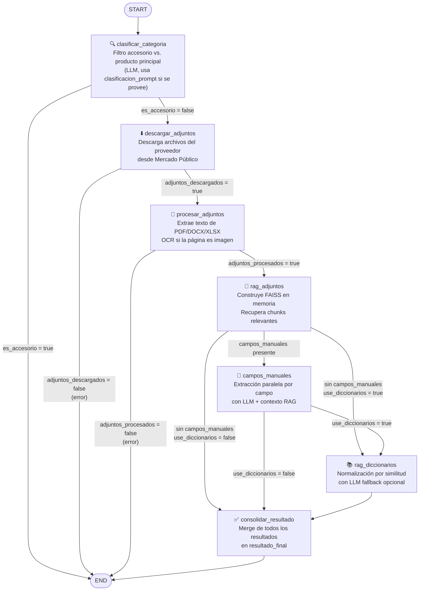
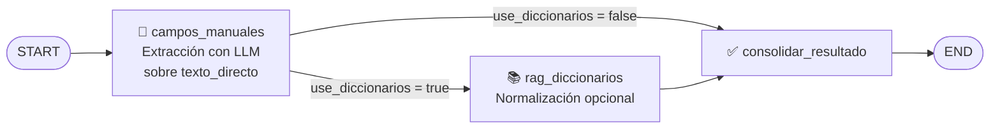
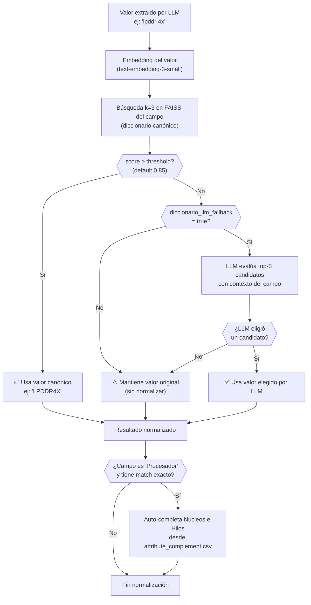
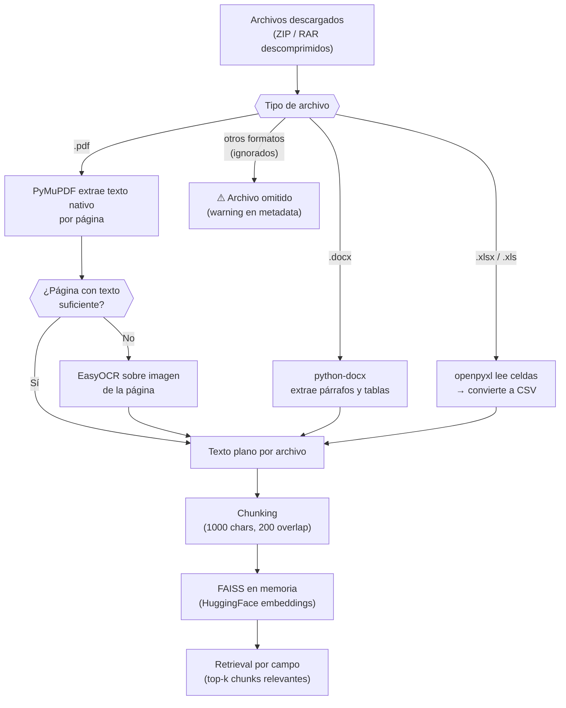
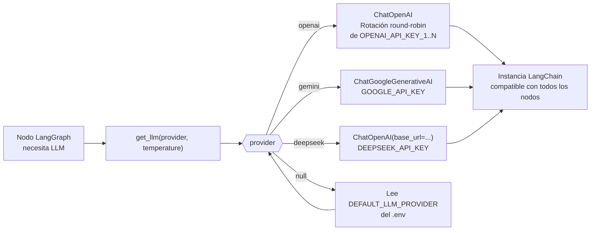
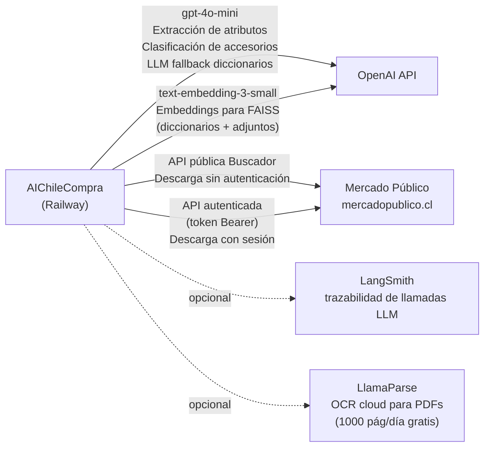
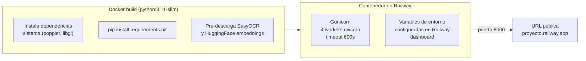

# AIChileCompra — API de Catalogación Automática

API REST para extracción automática de atributos de productos en compras públicas chilenas, usando LLM, RAG y LangGraph.

---

## Inicio rápido

### 1. Configurar el entorno

Copia `.env.example` a `.env` y edita las claves necesarias:

```bash
cp .env.example .env
```

Campos mínimos a cambiar:

| Variable | Descripción |
|---|---|
| `OPENAI_API_KEY` | API key de OpenAI — requerida siempre (usada para embeddings) |
| `API_KEY` | Clave para autenticar las llamadas a esta API |
| `GOOGLE_API_KEY` | Solo si usas `gemini` como proveedor LLM |
| `DEEPSEEK_API_KEY` | Solo si usas `deepseek` como proveedor LLM |

El proveedor por defecto se controla con `DEFAULT_LLM_PROVIDER` (`openai`, `gemini` o `deepseek`).

> **Nota:** `OPENAI_API_KEY` es siempre necesaria aunque uses Gemini o DeepSeek como LLM, porque los embeddings FAISS usan `text-embedding-3-small` de OpenAI.

### 2. Instalar dependencias

```bash
pip install -r requirements.txt
```

### 3. Iniciar la API

```bash
python main.py
```

La API queda disponible en `http://localhost:8000`.
Documentación interactiva: `http://localhost:8000/docs`

---

## Autenticación

Todos los endpoints requieren el header `x-api-key` con el valor configurado en `API_KEY` del `.env`.

```bash
curl -H "x-api-key: tu-clave" ...
```

---

## Endpoints

### `POST /catalogar` — Compra Ágil

Cataloga un producto de una **solicitud de cotización** (Compra Ágil). Descarga los adjuntos del proveedor desde Mercado Público y extrae atributos usando RAG.

**Request body:**

```json
{
  "payload": {
    "Categoria": "Computadores",
    "DescripcionProductoComprador": "NOTEBOOK RYZEN 7, 16GB DE RAM, SSD M.2 1TB, PANTALLA 13.3\"",
    "DescripcionProductoProveedor": "NOTEBOOK RYZEN 7, 16GB DE RAM, SSD M.2 1TB, PANTALLA 13.3\"",
    "productoname": "Notebook, laptop o computador portátil excepto Tablet PC"
  },
  "codigo_cotizacion": "377-164-COT24",
  "rut_proveedor": "76292976-7",
  "use_diccionarios": true,
  "campos_manuales": [
    { "campo": "Tipo", "contexto": "Responde SOLO una de estas opciones exactas: 'Laptop', 'Desktop', 'AIO', 'Otro'. 'Laptop' para notebooks/portátiles, 'Desktop' para PC de escritorio torres, 'AIO' para All-in-One, 'Otro' si no es ninguno de los anteriores." },
    { "campo": "Part Number", "contexto": "Extrae el número de parte del fabricante (P/N, SKU, Código de Producto). Es un código alfanumérico único que identifica el modelo (ej: '15-EH1005LA', '82KT00GMUS'). NO es el número de serie ni el Asset Tag. Si no se encuentra, responde 'No disponible'." },
    { "campo": "Modelo", "contexto": "Extrae el nombre completo del modelo del producto (ej: 'HP Pavilion 15-EH1005LA', 'Lenovo IdeaCentre AIO 3'). Si no se encuentra, responde 'No disponible'." },
    { "campo": "Procesador", "contexto": "Extrae el modelo exacto y completo. Si la ficha técnica y la descripción difieren, usa siempre la ficha." },
    { "campo": "Marca", "contexto": "Extrae solo el nombre de la marca fabricante." },
    { "campo": "Tipo RAM", "contexto": "Copia el sufijo exacto: LPDDR4X ≠ LPDDR4, LPDDR5X ≠ LPDDR5." },
    { "campo": "Tipo Almacenamiento", "contexto": "Solo el tipo, sin capacidad (ej: 'SSD', 'HDD', 'SSD/eMMC')." },
    { "campo": "Sistema Operativo", "contexto": "Nombre completo del SO. Si no está mencionado explícitamente, responde 'No disponible'." },
    { "campo": "RAM (GB)", "contexto": "Solo el número seguido de 'GB' (ej: '16 GB')." },
    { "campo": "Almacenamiento (GB)", "contexto": "Solo el número seguido de 'GB'. Convierte TB a GB si es necesario." },
    { "campo": "Pantalla (Pulgadas)", "contexto": "Solo el número en pulgadas, sin unidades (ej: '15.6')." },
    { "campo": "Nucleos", "contexto": "Responde solo el número de núcleos del procesador (ej: '8'). Si el Procesador está en el diccionario, este campo se completará automáticamente." },
    { "campo": "Hilos", "contexto": "Responde solo el número de hilos del procesador (ej: '16'). Si el Procesador está en el diccionario, este campo se completará automáticamente." }
  ],
  "diccionario_similarity_threshold": 0.85,
  "diccionario_llm_fallback": true,
  "token_bearer": "TOKEN_OBTENIDO_AL_LOGEAR"
}
```

| Campo | Tipo | Default | Descripción |
|---|---|---|---|
| `payload` | objeto | — | Datos del producto (ver estructura arriba) |
| `codigo_cotizacion` | string | — | Código de la cotización (ej: `377-164-COT24`) |
| `rut_proveedor` | string | — | RUT del proveedor (ej: `76292976-7`) |
| `use_diccionarios` | bool | `false` | Normalizar campos con diccionarios usando similitud de embeddings |
| `llm_provider` | string\|null | `null` | `"openai"`, `"gemini"` o `"deepseek"`. `null` usa `DEFAULT_LLM_PROVIDER` del `.env` |
| `campos_manuales` | lista\|null | `null` | Campos adicionales a extraer. Acepta strings simples o dicts `{campo, contexto}` (ver abajo) |
| `diccionario_similarity_threshold` | float | `0.85` | Score mínimo de similitud coseno para aceptar un match del diccionario (0–1) |
| `diccionario_llm_fallback` | bool | `true` | Si no hay match automático, usar LLM para decidir entre top-3 candidatos |
| `token_bearer` | string\|null | `null` | Token Bearer de Mercado Público. Si se omite, usa el token seteado en `/set-token`; si tampoco hay, usa API pública |
| `clasificacion_prompt` | string\|null | `null` | Descripción de la categoría para filtrar accesorios. Si se omite, no se filtra |

**Categorías soportadas:** `Computadores`

---

### `POST /catalogar/licitacion` — Licitación

Cataloga un producto de una **licitación pública**. Descarga los anexos técnicos y económicos del portal público de Mercado Público sin autenticación, y ejecuta el mismo pipeline de extracción que `/catalogar`.

El formato del código de licitación varía según el tipo: `1234-567-LE24` (licitación pública), `1234-567-LP24` (licitación privada), `1234-567-LR22` (remate), etc.

**Request body:**

```json
{
  "payload": {
    "Categoria": "Computadores",
    "DescripcionProductoComprador": "COMPUTADOR TODO EN UNO 24 PULGADAS",
    "DescripcionProductoProveedor": "AIO LENOVO IDEACENTRE 3",
    "productoname": "Computadores de escritorio"
  },
  "codigo_licitacion": "4179-44-LR22",
  "rut_proveedor": "96.523.180-3",
  "use_diccionarios": true,
  "llm_provider": "gemini",
  "campos_manuales": [
    {
      "campo": "tipo_equipo",
      "contexto": "Forma del factor del equipo principal. Laptop=portátil/notebook/ultrabook. AIO=All-in-One. Desktop=torre/mini-PC. Otro=tablet/convertible. Valores: Laptop | AIO | Desktop | Otro"
    },
    {
      "campo": "procesador_principal",
      "contexto": "Modelo completo del procesador principal. En multi-socket, reportar el de mayor jerarquía."
    },
    {
      "campo": "total_ram_gb",
      "contexto": "Capacidad total de RAM instalada en GB. Sumar todos los módulos. Solo RAM principal, no VRAM."
    },
    {
      "campo": "tecnologia_ram",
      "contexto": "Estándar de tecnología de la RAM. Reportar la más alta. Jerarquía: LPDDR5X > DDR5 > LPDDR5 > LPDDR4X > DDR4 > LPDDR4 > DDR3L > DDR3"
    },
    {
      "campo": "pantalla_pulgadas",
      "contexto": "Tamaño diagonal de la pantalla en pulgadas. Reportar como número decimal. No confundir con resolución."
    },
    "part_number"
  ],
  "diccionario_similarity_threshold": 0.85,
  "diccionario_llm_fallback": true,
  "clasificacion_prompt": "Computadores de escritorio y All-in-One. No incluye monitores, teclados, mouse ni periféricos."
}
```

| Campo | Tipo | Default | Descripción |
|---|---|---|---|
| `payload` | objeto | — | Datos del producto (misma estructura que `/catalogar`) |
| `codigo_licitacion` | string | — | Código de la licitación (ej: `4179-44-LR22`, `1234-567-LE24`) |
| `rut_proveedor` | string | — | RUT del proveedor |
| `use_diccionarios` | bool | `true` | Normalizar campos con diccionarios |
| `llm_provider` | string\|null | `null` | `"openai"`, `"gemini"` o `"deepseek"`. `null` usa `DEFAULT_LLM_PROVIDER` del `.env` |
| `campos_manuales` | lista\|null | `null` | Campos a extraer. Acepta strings simples o dicts `{campo, contexto}` — igual que `/catalogar` |
| `diccionario_similarity_threshold` | float | `0.85` | Score mínimo de similitud coseno para aceptar un match del diccionario (0–1) |
| `diccionario_llm_fallback` | bool | `true` | Si no hay match automático, usar LLM para decidir entre top-3 candidatos |
| `clasificacion_prompt` | string\|null | `null` | Descripción de la categoría para filtrar accesorios. Si se omite, no se filtra |

**Metadata de respuesta** (campo `metadata`):

```json
{
  "codigo_licitacion": "4179-44-LR22",
  "rut_proveedor": "96.523.180-3",
  "categoria": "Computadores",
  "adjuntos_descargados": true,
  "adjuntos_procesados": true,
  "use_diccionarios": true,
  "llm_provider": "gemini",
  "tiempos": [...],
  "tipo": "licitacion"
}
```

---

### `POST /catalogar/texto` — Texto directo (sin adjuntos)

Cataloga un producto a partir de texto libre, sin descargar adjuntos de Mercado Público. Útil cuando el texto del producto ya está disponible (fichas técnicas pre-procesadas, strings de BD, etc.).

Usa el mismo LLM, los mismos prompts y los mismos diccionarios de normalización que `/catalogar`, pero el texto de entrada reemplaza al contenido de los adjuntos como contexto RAG.

**Request body:**

```json
{
  "nombre_producto": "Notebook HP Pavilion 15-EH1005LA",
  "descripcion": "Notebook con AMD Ryzen 7 5700U, 16GB RAM LPDDR4X, 512GB SSD NVMe",
  "atributos": {
    "Procesador": "AMD Ryzen 7 5700U",
    "RAM": "16 GB LPDDR4X",
    "Almacenamiento": "512 GB SSD M.2 NVMe"
  },
  "categoria": "Computadores",
  "use_diccionarios": true,
  "llm_provider": "gemini",
  "campos_manuales": [
    { "campo": "Procesador", "contexto": "Extrae el modelo exacto y completo." },
    "Marca",
    "RAM (GB)",
    "Tipo RAM",
    "Almacenamiento (GB)"
  ]
}
```

| Campo | Tipo | Default | Descripción |
|---|---|---|---|
| `nombre_producto` | string | **requerido** | Nombre del producto |
| `descripcion` | string\|null | `null` | Descripción libre del producto |
| `atributos` | objeto\|null | `null` | Tabla de especificaciones técnicas `{campo: valor}` |
| `categoria` | string | `"Computadores"` | Solo `"Computadores"` por ahora |
| `use_diccionarios` | bool | `true` | Normalizar con diccionarios técnicos |
| `llm_provider` | string\|null | `null` | `"openai"`, `"gemini"` o `"deepseek"`. `null` usa `DEFAULT_LLM_PROVIDER` del `.env` |
| `campos_manuales` | lista\|null | `null` | Campos a extraer. Strings simples o dicts `{campo, contexto}` |
| `diccionario_similarity_threshold` | float | `0.85` | Score mínimo de similitud |
| `diccionario_llm_fallback` | bool | `true` | LLM fallback para matches dudosos |

**Response:** mismo formato que `/catalogar`. El campo `ROWNUM` en `resultado` es un UUID generado automáticamente.

**Ejemplo curl:**

```bash
curl -X POST http://localhost:8000/catalogar/texto \
  -H "x-api-key: tu-clave" \
  -H "Content-Type: application/json" \
  -d '{
    "nombre_producto": "Notebook HP Pavilion 15-EH1005LA",
    "descripcion": "Notebook con AMD Ryzen 7 5700U, 16GB RAM LPDDR4X, 512GB SSD NVMe",
    "atributos": {"Procesador": "AMD Ryzen 7 5700U", "RAM": "16 GB LPDDR4X"},
    "categoria": "Computadores",
    "use_diccionarios": true,
    "campos_manuales": ["Procesador", "Marca", "RAM (GB)", "Tipo RAM"]
  }'
```

---

### `POST /set-token` — Guardar token

Guarda el token Bearer de Mercado Público. Una vez seteado, todos los llamados a `/catalogar` lo usan automáticamente si no viene en el body.

```json
{ "access_token": "eyJ...", "obtained_at": "2026-03-13T10:00:00" }
```

> El token se persiste en disco (`attachments/.token_store.json`), por lo que sobrevive reinicios del servidor. Se sobreescribe al llamar `/set-token` nuevamente.

### `GET /get-token` — Consultar token guardado

Retorna el token actualmente persistido. Devuelve 404 si no hay ninguno.

---

## Campos manuales

`campos_manuales` acepta strings simples o dicts `{ "campo": "...", "contexto": "..." }`. El `contexto` se inyecta en el prompt del agente de ese campo como instrucción adicional, sin reemplazar las instrucciones base.

Los campos marcados con ★ tienen diccionario de valores canónicos — si `use_diccionarios: true`, el valor extraído se normaliza por similitud de embeddings contra ese diccionario.

```json
"campos_manuales": [
  {
    "campo": "Tipo",
    "contexto": "Responde SOLO una de estas opciones exactas: 'Laptop', 'Desktop', 'AIO', 'Otro'. 'Laptop' para notebooks/portátiles, 'Desktop' para PC de escritorio torres, 'AIO' para All-in-One, 'Otro' si no es ninguno de los anteriores."
  },
  {
    "campo": "Part Number",
    "contexto": "Extrae el número de parte del fabricante (P/N, SKU, Código de Producto). Es un código alfanumérico único que identifica el modelo (ej: '15-EH1005LA', '82KT00GMUS'). NO es el número de serie ni el Asset Tag. Si no se encuentra, responde 'No disponible'."
  },
  {
    "campo": "Modelo",
    "contexto": "Extrae el nombre completo del modelo del producto (ej: 'HP Pavilion 15-EH1005LA', 'Lenovo IdeaCentre AIO 3'). Si no se encuentra, responde 'No disponible'."
  },
  {
    "campo": "Procesador",
    "contexto": "Extrae el modelo exacto y completo (ej: 'Intel Core i7-1355U', 'AMD Ryzen 7 7735U'). Si la ficha técnica y la descripción del proveedor difieren, usa siempre la ficha técnica."
  },
  {
    "campo": "Marca",
    "contexto": "Extrae solo el nombre de la marca fabricante (ej: 'HP', 'Lenovo', 'Dell'). Puedes inferirla desde el nombre del modelo si no está escrita explícitamente."
  },
  {
    "campo": "Tipo RAM",
    "contexto": "Extrae solo el tipo/tecnología de RAM, SIN capacidades ni números. Copia el sufijo exacto tal como aparece en el documento: LPDDR4X ≠ LPDDR4, LPDDR5X ≠ LPDDR5. Para Apple con memoria unificada responde 'Memoria Unificada'."
  },
  {
    "campo": "Tipo Almacenamiento",
    "contexto": "Extrae solo el tipo de almacenamiento sin capacidad (ej: 'SSD', 'HDD', 'SSD/eMMC'). No incluyas GB ni TB en la respuesta."
  },
  {
    "campo": "Sistema Operativo",
    "contexto": "Extrae el nombre completo y exacto del SO (ej: 'Microsoft Windows 11 Home', 'FreeDOS', 'macOS'). No asumas el SO por la marca o modelo — si no está mencionado explícitamente, responde 'No disponible'."
  },
  {
    "campo": "RAM (GB)",
    "contexto": "Responde solo el número seguido de 'GB' (ej: '16 GB'). Si encuentras TB, conviértelo a GB."
  },
  {
    "campo": "Almacenamiento (GB)",
    "contexto": "Responde solo el número seguido de 'GB' (ej: '512 GB'). Si encuentras TB, conviértelo a GB (1 TB = 1000 GB)."
  },
  {
    "campo": "Pantalla (Pulgadas)",
    "contexto": "Responde solo el número en pulgadas, sin unidades (ej: '15.6', '13.3')."
  },
  {
    "campo": "Nucleos",
    "contexto": "Responde solo el número de núcleos del procesador (ej: '8'). Si el Procesador está en el diccionario, este campo se completará automáticamente."
  },
  {
    "campo": "Hilos",
    "contexto": "Responde solo el número de hilos del procesador (ej: '16'). Si el Procesador está en el diccionario, este campo se completará automáticamente."
  }
]
```

**Campos con diccionario de normalización (★):** `Procesador`, `Marca`, `Tipo RAM`, `Tipo Almacenamiento`, `Sistema Operativo`

> Si el Procesador tiene match en el diccionario de procesadores, `Nucleos` e `Hilos` se completan automáticamente aunque no estén en `campos_manuales`.

---

## Normalización con diccionarios (`use_diccionarios: true`)

Cuando está habilitada, después de la extracción RAG se aplica una capa de normalización por similitud de embeddings para los campos cubiertos por `diccionario_features.xlsx` (Tipo RAM, Sistema Operativo, Tipo Almacenamiento, Marca, Procesador).

**Flujo por campo:**

```
valor extraído
      ↓
embedding similarity vs. diccionario del campo (k=3)
      ↓
¿score ≥ diccionario_similarity_threshold?
   SÍ → usa valor normalizado del diccionario
   NO → ¿diccionario_llm_fallback = true?
           SÍ → LLM evalúa los top-3 candidatos → normaliza o mantiene original
           NO → mantiene el valor original
```

Adicionalmente, si el campo `Procesador` tiene match en el diccionario, los campos `Nucleos` e `Hilos` se completan automáticamente desde `diccionario_procesador.xlsx`.

---

## Response

Todos los endpoints de catalogación devuelven:

```json
{
  "success": true,
  "resultado": {
    "ROWNUM": "abc12345",
    "Tipo": "Laptop",
    "Part Number": "15-EH1005LA",
    "Modelo": "HP Pavilion 15-EH1005LA",
    "Procesador": "AMD Ryzen 7 5700U",
    "RAM (GB)": "16 GB",
    "Tipo RAM": "LPDDR4X",
    "Almacenamiento (GB)": "512 GB",
    "Tipo Almacenamiento": "SSD NVMe",
    "Pantalla (Pulgadas)": "15.6",
    "Marca": "HP",
    "Nucleos": "8",
    "Hilos": "16"
  },
  "errores": [],
  "warnings": [],
  "metadata": {
    "codigo_cotizacion": "377-164-COT24",
    "rut_proveedor": "76292976-7",
    "categoria": "Computadores",
    "adjuntos_descargados": true,
    "adjuntos_procesados": true,
    "use_diccionarios": true,
    "llm_provider": "openai"
  }
}
```

El campo `ROWNUM` siempre está presente en `resultado`. El resto de los atributos depende de los `campos_manuales` enviados en el request.

---

## Diferencias entre endpoints

| | `/catalogar` (Compra Ágil) | `/catalogar/licitacion` | `/catalogar/texto` |
|---|---|---|---|
| Tipo de proceso | Solicitud de cotización | Licitación pública | Texto libre (sin proceso MP) |
| Código requerido | `codigo_cotizacion` | `codigo_licitacion` | — |
| Autenticación Mercado Público | Opcional (`token_bearer` o `/set-token`) | No requerida | No requerida |
| `use_diccionarios` default | `false` | `true` | `true` |
| Adjuntos | Archivos del proveedor (ofertas) | Anexos técnicos y económicos | — (texto en el body) |
| Pipeline de extracción | LangGraph + agentes | Mismo que Compra Ágil | Mismo que Compra Ágil |
| `campos_manuales` | strings o `{campo, contexto}` | strings o `{campo, contexto}` | strings o `{campo, contexto}` |
| `clasificacion_prompt` | ✓ | ✓ | — |
| `tiempos` en metadata | ✓ | ✓ | ✓ |

---

## Configuración del `.env`

Ver `.env.example` para la lista completa. Las más relevantes:

```env
# Proveedor LLM por defecto
DEFAULT_LLM_PROVIDER=openai          # openai | gemini | deepseek

# Claves API
OPENAI_API_KEY=sk-...                # Siempre requerida (embeddings)
GOOGLE_API_KEY=AIza...               # Solo si DEFAULT_LLM_PROVIDER=gemini
DEEPSEEK_API_KEY=...                 # Solo si DEFAULT_LLM_PROVIDER=deepseek

# Modelos LLM
OPENAI_MODEL=gpt-4o-mini
GEMINI_MODEL=gemini-2.5-flash
DEEPSEEK_MODEL=deepseek-chat

# Seguridad
API_KEY=cambia-esto

# Caché de adjuntos (aplica a /catalogar y /catalogar/licitacion)
# 0 = sin caché, siempre re-descarga (default)
# >0 = reutiliza archivos si son más frescos que N segundos
ATTACHMENTS_CACHE_TTL_SECONDS=0
```

---

## Arquitectura

### Visión general

El sistema se organiza en cuatro capas: la API REST recibe las peticiones, un orquestador selecciona el pipeline adecuado, el motor LangGraph ejecuta el flujo de extracción, y una capa de componentes provee los servicios de bajo nivel (LLM, RAG, diccionarios, adjuntos).



---

### Flujo de una petición (`/catalogar`)

Muestra el ciclo completo de vida de un request de Compra Ágil, desde la llamada HTTP hasta la respuesta JSON.



---

### Grafo LangGraph (Compra Ágil)

El pipeline de Compra Ágil es un grafo dirigido con siete nodos y rutas condicionales que permiten cortocircuitar el flujo ante errores o productos filtrados.



**Grafo simplificado para `/catalogar/texto`** (omite los nodos de descarga y RAG de adjuntos — el texto ya viene en el estado):



---

### Pipeline de normalización con diccionarios

Cuando `use_diccionarios: true`, cada campo con diccionario asociado pasa por esta lógica después de la extracción RAG. Los diccionarios se precalientan como índices FAISS al arrancar el servidor.



---

### Procesamiento de adjuntos

El módulo de procesamiento convierte cualquier formato de archivo del proveedor en texto plano listo para indexar en FAISS.



---

### Proveedores LLM

Todos los nodos que requieren un LLM obtienen la instancia a través de `agents/get_agent.py`, que abstrae el proveedor y soporta rotación de claves para OpenAI.



---

### Servicios externos

El sistema depende de los siguientes servicios externos. Los servicios opcionales se activan solo si se configuran las claves correspondientes en el `.env`.



| Servicio | Rol | Variable de entorno |
|---|---|---|
| **OpenAI** `gpt-4o-mini` | LLM principal: extracción de atributos, clasificación de accesorios, LLM fallback de diccionarios | `OPENAI_API_KEY`, `OPENAI_MODEL` |
| **OpenAI** `text-embedding-3-small` | Embeddings vectoriales para FAISS (diccionarios y adjuntos) | `OPENAI_API_KEY` |
| **Mercado Público** | Fuente de archivos del proveedor (fichas técnicas, anexos) | Claves embebidas en código |
| **LangSmith** _(opcional)_ | Observabilidad y trazabilidad de llamadas LLM | `LANGCHAIN_API_KEY`, `LANGCHAIN_PROJECT` |
| **LlamaParse** _(opcional)_ | OCR cloud para PDFs escaneados, como alternativa a EasyOCR local | `LLAMA_CLOUD_API_KEY` |

---

### Despliegue en Railway

La API se despliega como contenedor Docker en Railway. El `Dockerfile` incluye la descarga de modelos de EasyOCR y HuggingFace durante el build para que el arranque en producción sea inmediato.



**Variables de entorno requeridas en Railway:**

```
OPENAI_API_KEY=sk-...
API_KEY=clave-secreta-de-autenticacion
DEFAULT_LLM_PROVIDER=openai
OPENAI_MODEL=gpt-4o-mini
KMP_DUPLICATE_LIB_OK=TRUE
```

> El token de Mercado Público se persiste en `attachments/.token_store.json` dentro del contenedor. En Railway, el filesystem es efímero — si el servicio se reinicia, el token se pierde y debe re-setearse vía `POST /set-token`.

---

### Prompts de los agentes

El sistema usa tres prompts distintos dependiendo del nodo que se ejecute.

#### Agente clasificador de accesorios (`clasificar_categoria`)

Se ejecuta solo cuando `clasificacion_prompt` está configurado en el request. Decide si el producto es de la categoría buscada o es un accesorio y debe ignorarse.

**Modelo:** `gpt-4o-mini` · **Temperatura:** `0.0`

```
Eres un clasificador de productos de compras públicas. Tu única tarea es determinar
si el producto descrito es de la categoría buscada o es un accesorio/producto diferente.

CATEGORÍA BUSCADA:
Computadores portátiles y de escritorio. No incluye monitores, teclados, mouse ni bolsos.

PRODUCTO A CLASIFICAR:
- Categoría declarada: Computadores
- Nombre: Mouse inalámbrico USB
- Descripción comprador: MOUSE INALAMBRICO NEGRO 1600DPI
- Descripción proveedor: Mouse Logitech M185 inalámbrico

INSTRUCCIONES:
- Si el producto corresponde a la categoría buscada → responde EXACTAMENTE: NO_ACCESORIO
- Si el producto es un accesorio, periférico, o no corresponde a la categoría → responde EXACTAMENTE: ACCESORIO
- Responde SOLO una de esas dos palabras, sin explicación.
```

**Respuesta esperada:** `ACCESORIO` o `NO_ACCESORIO`

---

#### Agente de extracción de campo (`campos_manuales`)

Se lanza un agente en paralelo por cada campo en `campos_manuales`. Cada agente recibe los chunks más relevantes del FAISS (top-k por similitud semántica con el nombre del campo) como contexto.

**Modelo:** `gpt-4o-mini` · **Temperatura:** `0.1`

```
Eres un agente especializado en extraer información sobre **Procesador** de productos.

Producto:
- Categoría: Computadores
- Nombre: Notebook, laptop o computador portátil excepto Tablet PC
- Descripción Comprador: NOTEBOOK RYZEN 7, 16GB DE RAM, SSD M.2 1TB, PANTALLA 13.3"
- Descripción Proveedor: NOTEBOOK RYZEN 7 5700U HP PAVILION

Contexto de documentos:
Fragmento 1:
Procesador: AMD Ryzen™ 7 5700U (1.8 GHz velocidad base, hasta 4.3 GHz velocidad máx,
8 núcleos, 16 MB caché L3, 15 W TDP)
RAM: 16 GB DDR4-3200 MHz (1 x 16 GB)
Almacenamiento: 512 GB M.2 PCIe® NVMe™ SSD

Fragmento 2:
[...más chunks relevantes del mismo archivo o de otros adjuntos...]

Tu tarea es extraer ÚNICAMENTE la información sobre **Procesador** del producto.

REGLAS GENERALES:
1. Responde SOLO con el valor extraído, SIN explicaciones ni texto adicional
2. FUENTE PRINCIPAL: El "Contexto de documentos" (fichas técnicas adjuntas) es la fuente
   autorizada. Si la ficha técnica y la descripción del proveedor difieren, usa siempre la ficha.
3. FALLBACK: Solo si la información NO aparece en los documentos adjuntos, puedes usar la
   "Descripción Proveedor" como referencia secundaria. Si tampoco está ahí, responde "No especificado".
4. NO inventes información — extrae SOLO lo que aparece explícitamente en los documentos
5. Sé PRECISO y conciso
6. FOCO EN EL PRODUCTO PRINCIPAL: el contexto puede contener fichas de múltiples productos
   (el computador principal más accesorios). Extrae el atributo ÚNICAMENTE del producto
   identificado por la descripción del comprador/proveedor.

INSTRUCCIONES ESPECÍFICAS PARA ESTE CAMPO:
- Extrae el modelo exacto y completo (ej: 'Intel Core i7-1355U', 'AMD Ryzen 7 7735U').
  Si la ficha técnica y la descripción del proveedor difieren, usa siempre la ficha técnica.

Valor de Procesador:
```

**Respuesta esperada:** `AMD Ryzen 7 5700U`

---

#### LLM fallback del normalizador (`rag_diccionarios`)

Se invoca cuando la similitud coseno entre el valor extraído y los candidatos del diccionario está por debajo del `diccionario_similarity_threshold`. El LLM decide si alguno de los top-3 candidatos es el mismo concepto.

**Modelo:** `gpt-4o-mini` · **Temperatura:** configurada por `TEMPERATURE_ADJUNTOS` (default `0.7`)

```
Se extrajo el valor "Win 11 Pro" para el campo "Sistema Operativo".

Candidatos del diccionario (por similitud descendente):
1. Microsoft Windows 11 Pro (similitud: 0.81)
2. Microsoft Windows 11 Home (similitud: 0.79)
3. Microsoft Windows 10 Pro (similitud: 0.74)

¿Alguno de estos candidatos es el mismo producto/versión base que "Win 11 Pro"?
Criterio: acepta si el candidato es la versión estándar del mismo producto
(ej: 'Windows 11 Home Single Language' → 'Microsoft Windows 11 Home',
'Win 11 Pro' → 'Microsoft Windows 11 Pro', 'macOS Sonoma' → 'macOS').
Responde ÚNICAMENTE con el texto exacto del candidato si hay match,
o con la palabra "ninguno" si ninguno corresponde.
```

**Respuesta esperada:** `Microsoft Windows 11 Pro`
